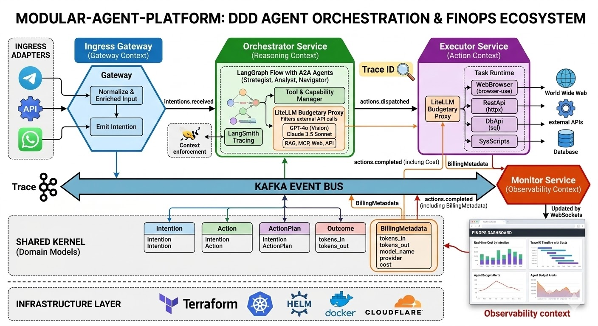

# 🤖 AIOps 360: Plataforma de Observabilidad Activa y Agentes Autónomos


**AIOps 360** es una plataforma de monitorización sintética proactiva. En lugar de esperar a que los sistemas fallen (monitorización reactiva), esta plataforma orquesta "usuarios digitales" (Agentes IA) que validan continuamente la experiencia de usuario, las APIs y la infraestructura, reportando hallazgos con contexto enriquecido y trazabilidad financiera (FinOps).



## 🎯 El Problema vs. La Solución

* **El Problema (Reactivo):** La monitorización tradicional basada en métricas de CPU/RAM genera silos y falsos positivos. Saber que la base de datos está lenta no garantiza que el usuario pueda hacer login. El equipo técnico a menudo se entera de las caídas críticas cuando el cliente se queja.
* **La Solución (Proactivo):** Orquestar agentes autónomos que simulan ser usuarios reales (Navegación Web), sistemas (Peticiones API) e ingenieros SRE (Consultas de Infraestructura y RAG). Todo centralizado, asíncrono y con un presupuesto de IA controlado.

---

## 🏗️ Arquitectura del Sistema

El proyecto sigue una arquitectura **Hexagonal (Puertos y Adaptadores)** y un diseño **Domain-Driven Design (DDD)**, estructurado como un ecosistema de microservicios orientados a eventos (Event-Driven) comunicados a través de **Apache Kafka**.

### Los 5 Bounded Contexts (Microservicios)

1. **Gateway Service (Ingress):** El adaptador de entrada universal. Recibe estímulos (Telegram, Webhooks, CronJobs planificados) y los normaliza en `Intentions`.
2. **Orchestrator Service (Reasoning):** El cerebro del sistema impulsado por **LangGraph**. Recibe una `Intention`, razona la mejor estrategia y la divide en `Actions` atómicas.
3. **Executor Service (Action):** El músculo. No piensa, solo ejecuta herramientas. Incluye ejecutores polimórficos (`browser-use` para webs, `httpx` para APIs, integraciones MCP para RAG/Jira). Utiliza **LiteLLM** como proxy para controlar el gasto de tokens.
4. **Notifier Service (Egress):** Enrutador de salidas. Envía alertas o respuestas formateadas por el canal adecuado (Telegram, Email, etc.).
5. **Monitor Service (Observability):** Escucha el bus de Kafka en la sombra, guardando el histórico en PostgreSQL para alimentar el **FinOps Dashboard** en tiempo real vía WebSockets.

---

## 🧠 Domain-Driven Design (El Lenguaje Ubicuo)

Para garantizar el desacoplamiento, todos los servicios comparten un **Shared Kernel** con las siguientes entidades core (implementadas en Pydantic):

* `Intention`: Representa **qué** se quiere lograr. (Ej: *"Revisa si el login funciona"*).
* `Action`: Representa el **cómo** atómico. Una intención puede generar múltiples acciones. (Ej: *"Abre Chromium en url X"*, *"Haz click en botón Y"*).
* `Outcome`: El resultado inmutable de una Acción. (Ej: *"Éxito: Tiempo de carga 1.2s"* o *"Fallo: Timeout 503"*).
* `BillingMetadata`: Objeto de valor que traza el coste exacto en tokens y dólares de cada interacción con LLMs (FinOps).

### 🚌 Eventos de Dominio (Tópicos de Kafka)

La "carretera" de la plataforma funciona con los siguientes eventos clave:
* `intentions.received`: Emitido por el Gateway.
* `actions.dispatched`: Emitido por el Orquestador hacia los Ejecutores.
* `actions.completed`: Emitido por los Ejecutores con el resultado y el coste (`BillingMetadata`).

---

## 🚀 Casos de Uso del Piloto (MVP)

1. **Agente Web:** Monitorización sintética de la UI simulando navegación humana.
2. **Agente API (Middleware):** Validación de latencias y códigos de estado en el clúster.
3. **Agente Infraestructura (K8s):** Chequeo de salud de nodos y Pods.
4. **Agente SRE Assistant (RAG/MCP):** Asistente conversacional capaz de cruzar incidencias actuales con documentación técnica y tickets de JIRA.

---

## 🛠️ Stack Tecnológico

* **Lenguaje:** Python 3.12+ (Monorepo)
* **Framework Core:** FastAPI, Pydantic
* **IA & Agentes:** LangGraph, LangSmith, LiteLLM, Anthropic/OpenAI APIs.
* **Automatización Web:** Playwright / `browser-use`
* **Infraestructura Asíncrona:** Apache Kafka (KRaft), Redis
* **Persistencia:** PostgreSQL (Datos relacionales), ChromaDB (Vectores RAG)
* **Despliegue (IaC):** Docker Compose (Local), Terraform & Helm (Producción)

---

## 💻 Entorno de Desarrollo (Getting Started)

### Prerrequisitos
* Docker y Docker Compose
* Python 3.12+ instalado

### 1. Levantar la Infraestructura Local
El proyecto incluye un entorno local preconfigurado con Kafka, Redis y PostgreSQL.

```bash
docker-compose up -d
```
Comprueba que los contenedores están corriendo con `docker ps`.

### 2. Configurar el Entorno Python
Recomendamos usar un entorno virtual en la raíz del monorepo:

```bash
python3 -m venv venv
source venv/bin/activate  # En Windows: venv\Scripts\activate
pip install pydantic fastapi uvicorn
```

---

## 📁 Estructura del Monorepo

```text
/modular-agent-platform
├── /shared                      # SHARED KERNEL: Entidades y Eventos DDD compartidos
├── /services                    # MICROSERVICIOS
│   ├── /gateway                 # Adaptadores de entrada (Telegram, API, Cron)
│   ├── /orchestrator            # Lógica de agentes (LangGraph)
│   ├── /executor                # Workers (BrowserUse, API calls)
│   ├── /notifier                # Alertas de salida
│   └── /monitor                 # API para el Dashboard
├── /frontend                    # OBSERVABILITY DASHBOARD (Next.js)
├── /infrastructure              # IaC (Terraform, Helm, Docker Compose)
└── docker-compose.yml           # Infra base de desarrollo
```

---
*Diseñado con principios Hexagonales para ser resiliente, agnóstico y a prueba de futuro.*